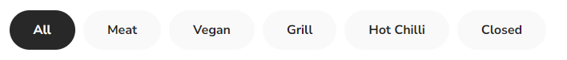
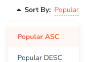
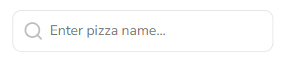
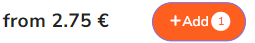
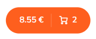
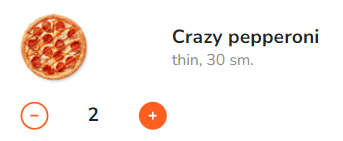
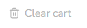
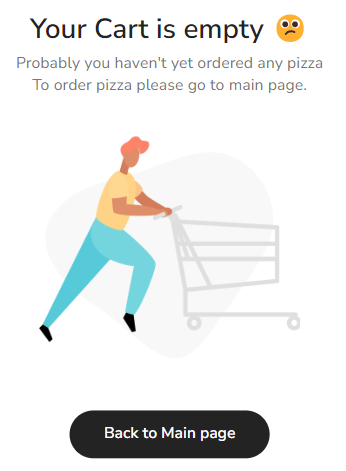

## Pizza shop with cart

Responsive small pizza shop with database of 10 pizzas from MockApi. Created while studying React.

## Live Demo

https://jarominas-react-pizza.netlify.app/

## Build with :

- React
- TypeScript
- Redux Toolkit
- SCSS
- MUI
- Styled Components

## Database from MockApi

https://6486e8e2beba6297278f7688.mockapi.io/items

## Components

---

#### Navigation Menu

here you can choose what kind of pizza you want to display

---

#### Sort Button

Here you can sort pizza by price, popularity etc.

---

#### Search Bar

You can seach pizza by name or word, for example "Pepperoni" or "Chicken" , it will search all pizzas with this name.

---

#### Add Button

Press to add pizza to the Cart

---

#### Сart entry button

---

#### You can increase or decrease the quantity of pizzas in the cart

You can add or remove pizzas in cart by pressing + or -

---

#### Clear button

to get

